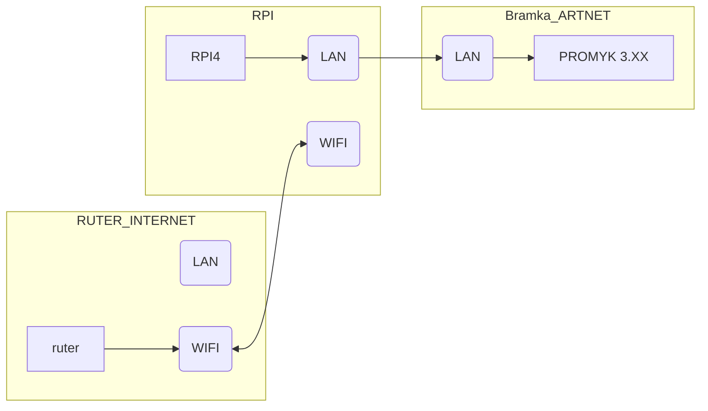
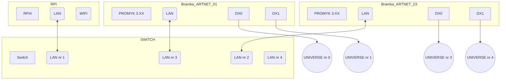

Komputery jednopłytkowe **(SBC – Single Board Computers)** mogą być z powodzeniem stosowane do sterowania oświetleniem pobierając o wiele mniej energii niż standardowe komputery i zapewniają wystarczającą moc obliczeniową do obsługi aplikacji DMX512. Mogą być schowane w szafach teleinformatycznych lub rozdzielniach elektrycznych jak używane na wszelkich imprezach na żywo z udziałem publiczneości.
Takim przykładem jest **RPI 4 model B Rev 1.1** zawierający 32 bitowy procesor i 4GB RAM.
Na nim można zainstalować QLC+ z repozytorium. Dzięki wbudowanej karcie WI-FI możemy podłączyć się pod ruter z Internetem a kartę Ethernet podłączyć do bramki Artnet np: PROMYK 3.XX.


***Rysunek nr 1: Podłączenie RPI do bramki Artnet i rutera***

Dane komputera RPI:

```shell
  lulek@lulek:~ $ cat /proc/cpuinfo 
processor	: 0
BogoMIPS	: 108.00
Features	: fp asimd evtstrm crc32 cpuid
CPU implementer	: 0x41
CPU architecture: 8
CPU variant	: 0x0
CPU part	: 0xd08
CPU revision	: 3

processor	: 1
BogoMIPS	: 108.00
Features	: fp asimd evtstrm crc32 cpuid
CPU implementer	: 0x41
CPU architecture: 8
CPU variant	: 0x0
CPU part	: 0xd08
CPU revision	: 3

processor	: 2
BogoMIPS	: 108.00
Features	: fp asimd evtstrm crc32 cpuid
CPU implementer	: 0x41
CPU architecture: 8
CPU variant	: 0x0
CPU part	: 0xd08
CPU revision	: 3

processor	: 3
BogoMIPS	: 108.00
Features	: fp asimd evtstrm crc32 cpuid
CPU implementer	: 0x41
CPU architecture: 8
CPU variant	: 0x0
CPU part	: 0xd08
CPU revision	: 3

Revision	: c03111
Serial		: 10000000a43957f6
Model		: Raspberry Pi 4 Model B Rev 1.1

```

wersja OS:

```shell
lulek@lulek:~ $ uname -a
Linux lulek 6.12.47+rpt-rpi-v8 #1 SMP PREEMPT Debian 1:6.12.47-1+rpt1~bookworm (2025-09-16) aarch64 GNU/Linux
```

Aby zainstalować QLC PLus na komputerze RPI należy w oknie konsoli sprawdzić czy program jest w repozytorium a potem go zainstalować.

```shell
lulek@lulek:~ $ sudo apt search qlcplus
Sorting... Done
Full Text Search... Done
qlcplus/stable,now 4.12.6-1 armhf 
  Control DMX or analog lighting systems

qlcplus-data/stable,now 4.12.6-1 all 
  Control DMX or analog lighting systems (data files)

  lulek@lulek:~ $ sudo apt install qlcplus

```

Dla ustawień fabryczn/ych bramki artnet "Promyk 3.xx" należy ustawić adres karty **eth0** na 192.168.1.2/24. Ponieważ w Linux można łatwo ustawiać podinterfejsy, więc można także ustawić drugi adres na tej karcie sieciowej **2.0.0.1/8** 


**Rysunek nr 2: Widok okna "Wired connection"**

```shell 
lulek@lulek:~ $ ip a
1: lo: <LOOPBACK,UP,LOWER_UP> mtu 65536 qdisc noqueue state UNKNOWN group default qlen 1000
    link/loopback 00:00:00:00:00:00 brd 00:00:00:00:00:00
    inet 127.0.0.1/8 scope host lo
       valid_lft forever preferred_lft forever
    inet6 ::1/128 scope host noprefixroute 
       valid_lft forever preferred_lft forever
2: eth0: <BROADCAST,MULTICAST,UP,LOWER_UP> mtu 1500 qdisc mq state UP group default qlen 1000
    link/ether dc:a6:32:1d:85:28 brd ff:ff:ff:ff:ff:ff
    inet 2.0.0.1/8 brd 2.255.255.255 scope global noprefixroute eth0
       valid_lft forever preferred_lft forever
    inet 192.168.1.2/24 brd 192.168.1.255 scope global noprefixroute eth0
       valid_lft forever preferred_lft forever
    inet6 fe80::dfd5:831c:bc67:430/64 scope link noprefixroute 
       valid_lft forever preferred_lft forever

```

Aby sprawdzić połączenie z bramką artnet należy wydać polecenie *ping adres_IPv4_urządzenia*:

```shell
lulek@lulek:~ $ ping 192.168.1.30
PING 192.168.1.30 (192.168.1.30) 56(84) bytes of data.
64 bytes from 192.168.1.30: icmp_seq=1 ttl=128 time=0.166 ms
64 bytes from 192.168.1.30: icmp_seq=2 ttl=128 time=0.130 ms
64 bytes from 192.168.1.30: icmp_seq=3 ttl=128 time=0.096 ms
^C
--- 192.168.1.30 ping statistics ---
3 packets transmitted, 3 received, 0% packet loss, time 2030ms
rtt min/avg/max/mdev = 0.096/0.130/0.166/0.028 ms

```

Po sprawdzeniu prawidłowości podłączenia należy uruchomić **QLC+**


**Rysunek nr 3: Okno 'Inputs/OutPuts' do ustawienia konfiguracji interfejsów DMX512**

Dla bramki Artnet wybiera się dla każdej zakładki *Universe X/MAPPING* zaznacza się **checkbox** Output dla adresu ip karty sieciowej do którego jest ona podłączona.

>Nie należy szukać W QLC+ w tej zakładce **MAPPING** adresu IPv4 bramki Artnet ale wskazuje się adres karty sieciowej komputera do którego mają trafiać pakiety ARTNET, a potem dotrą one do sterownika dmx512.

Po wciśnięciu ikony z prawej strony ekranu **śrubokręt z kluczem** pojawia się okno **Configure Artnet plugin** gdzie standardowo pojawiają się w polach adres **192.168.1.255** ,który jest adresem broadcast i żeby zmniejszyć obciążenie łącza należy ustawić adres **UNICAST** co jest równe **192.168.1.30**.

W tym przykładzie podłączono dwie bramki ArtNet **"PROMYK 3.50"** o adresach:

- 192.168.1.30 universe 0,1
- 192.168.1.31 universe 2,3

Taki układ daje pojemność 2048 kanałów DMX512. 



**Rysunek nr 4: Schemat infrastruktury sieciowej LAN i wyjść DMX512**


Przy konfiguracji kilku bramek Artnet należy podłączać je do switch'a pojedynczo i zmieniać ich adresy od ostatniego, czyli w tym przypadku adres fabryczny 192.168.1.30 należy zmienić 192.168.1.31 i zapisać za pomocą strony konfiguracji wbudowanej w "PROMYK 3.xx".


**Rysunek nr 5: Strona konfiguracji bramki Artnet Promyk 3.50**

Należy teraz zmienić adres ipv4 na 192.168.1.31 i Universe (DX0)-2 , (DX1)-3.


**Rysunek nr 6: Strona konfiguracji bramki Artnet Promyk 3.50 po zmianach**

Wtedy dopiero można podłączyć bramkę Artnet 01 i nie zmieniać jej parametrów.

QLC+ wykrywa wszystkie urządzenia sieciowe Artnet w zakładce **Nodes Tree**


**Rysunek nr 7: Zakładka Nodes Tree pokazuje znalezione bramki Artnet**

