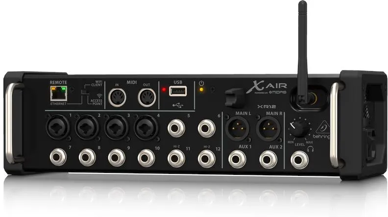

##### Sterowanie z jednego tabletu mikserem i aplikacją dmx512 może być dla mobilnych Dj-ów bardzo wygodne. 

Przykład takiego rozwiązania będzie dla modelu **Behringer X AIR XR12**, gdyż dla późniejszych modeli sprawa konfiguracji jest analogiczna.

*Behringer X AIR XR12*

 >  Instrukcja Behringer X AIR XR12/X16/XR18 [link](https://www.instrukcjaobslugipdf.pl/behringer/x-air-xr12/instrukcja) 

 Mikser posiada przełącznik **"WIFI CLIENT"** po prawej stronie złącza ETHERNET (XR12), który zmienia tryb pracy na *klienta WI-FI/LAN* lub *ACCESS POINT(DHCPS)*. 

 W trybie **ACCES POINT (DHCPS)** urządzenie jest źródłem WI-FI z serwerem DHCP lub na złączu LAN za pomocą serwera DHCP wystawia adres IP podłączonym urządzeniom. (strona 14 instrukcji miksera)

