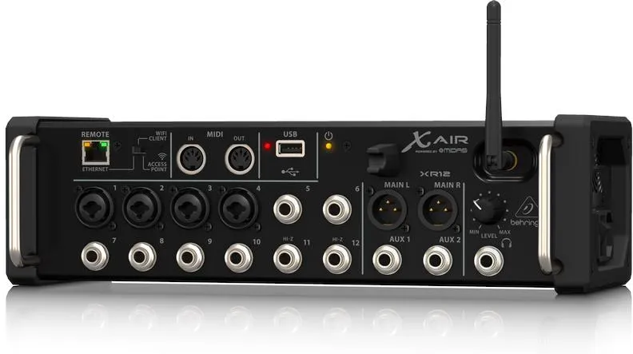

##### Sterowanie z jednego tabletu mikserem i aplikacją dmx512 może być dla mobilnych Dj-ów bardzo wygodne. 

Przykład takiego rozwiązania będzie dla modelu **Behringer X AIR XR12**, gdyż dla późniejszych modeli sprawa konfiguracji jest analogiczna.

*Behringer X AIR XR12*

