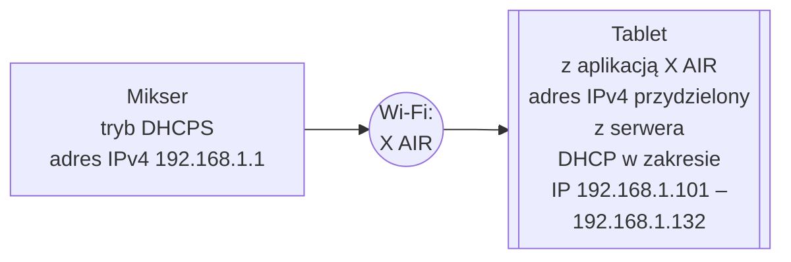

# Mikser i bramka Artnet sterowane z jednego tabletu

 **Sterowanie z jednego tabletu mikserem i aplikacją dmx512 może być dla mobilnych Dj-ów bardzo wygodne**. 

Przykład takiego rozwiązania będzie dla modelu **Behringer X AIR XR12**, gdyż dla późniejszych modeli sprawa konfiguracji jest analogiczna.

***Rysunek nr 1: Behringer X AIR XR12***

 >  Instrukcja Behringer X AIR XR12/X16/XR18 [link](https://www.instrukcjaobslugipdf.pl/behringer/x-air-xr12/instrukcja) 

 Mikser posiada przełącznik **"WIFI CLIENT/ACCESS POINT"** po prawej stronie złącza ETHERNET (XR12), który zmienia tryb pracy na *klienta WI-FI/LAN* lub *ACCESS POINT(DHCPS)*. 

 W trybie **ACCES POINT (DHCPS)** urządzenie jest źródłem WI-FI z serwerem DHCP lub na złączu LAN za pomocą serwera DHCP wystawia adres IP podłączonym urządzeniom. (strona 14 instrukcji miksera)

***Rysunek nr 2: Podłączenie tabletu  do Miksera w trybie DHCPS***

W aplikacji X AIR możemy zmienić ustawienie na DHCP lub STATIC. Docelowo głównym źródłem sieci LAN będzie ruter, do którego złącz LAN będą wpięte kable od miksera i bramki ArtNet. 

> Nie należy mylić tego połączenia lokalnego z Internetowym, tu nie jest potrzebny dostawca internetu.

***Rysunek nr 3: Okno Setup dla ustawień ETHERNET***

> **Jeśli wybrany został** STATIC **należy wpisać adres IP : 192.168.1.2 a maskę 255.255.255.0**, to założenia dla ustawień bramki Artnet *"PROMYK 3.60"* fabrycznych, ip: 192.168.1.30 maska: 255.255.255.0 

***Rysunek nr 4: Podłączenie miksera do rutera za pomocą przewodu typu patchcord LAN***

Przed podłączeniem należy zmienić pozycję **"WIFI CLIENT"**. 

Dla potrzeb tego przykładu wybrany został ruter firmy TPLINK ze względu na popularność, przystępne ceny oraz instrukcje w języku polskim. Także firma TPLINK udostępnia emulatory swoich produktów dzięki czemu możemy sprawdzić na ich stronie jak wygląda strona www ustawień rutera. [Emulator ruterów TPLINK](https://www.tp-link.com/pl/support/emulator/)

***Rysunek nr 5: Setup LAN rutera ***

