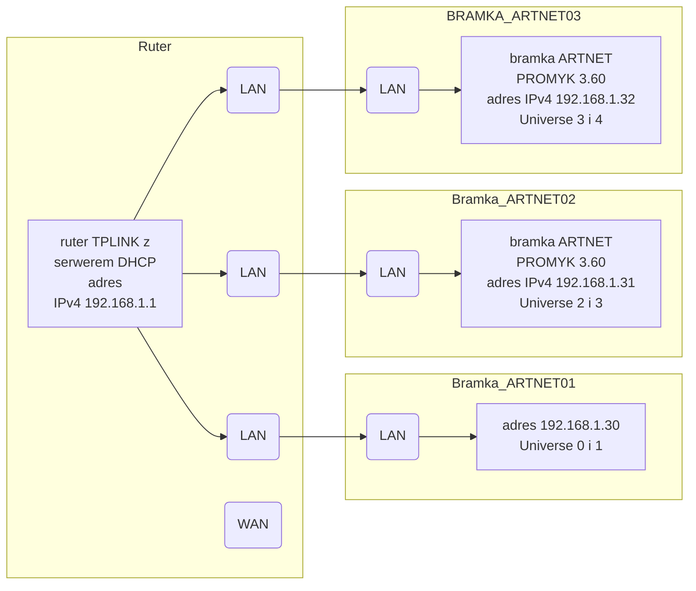

<!-- # Czy Ruter i Artnet wymagają dostępu do Internetu?  -->

 **Czy Ruter i Artnet wymagają dostępu do Internetu?**  

Czesto pojawia się pytanie czy do prawidłowego działania sieci Artnet i sterowania oświetleniem potrzebny jest dostęp do Internetu. Szczególnie gdy w zestawie znajduje się ruter.

> **Dobra wiadomość jest taka, że Internet nie jest potrzebny.**

Ruter jest urządzeniem samodzielnym, które nie potrzebuje zakupu internetu do prawidłowego funkcjonowania, on po prostu tworzy własną sieć LAN dostępną poprzez Wi-Fi lub gniazda Ethernet. 

**Tak więc w przypadku sieci Artnet, ruter pełni rolę centrum komunikacyjnego, umożliwiając przesyłanie danych DMX pomiędzy kontrolerem a urządzeniami oświetleniowymi bez konieczności korzystania Internetu.**

To urządzenie posiada złącza RJ-45 LAN(od ang. Local Area Network) i WAN(od ang. wide area network). 

***Rysunek nr 1: Gniazda RJ-45 rutera TPLINK, kolorem żółtym oznaczone są gniazda LAN, a niebieskim WAN***

***Rysunek nr 2: Gniazda RJ-45 rutera DLINK, kolorem szarym oznaczone są gniazda LAN, a żółtym WAN***

> *Na podstawie rysunków nr 1 i 2 gniazda LAN i WAN posiadają różną kolorystykę, ale gniazdo LAN i WAN różni się od siebie w danym modelu innym kolorem i dodatkowo są od siebie rozdzielone. Istnieją modele które złącze jest w formacie RJ-11(DSL, ADSL) lub brak gdy posiadają modem z dostępem do sieci komórkowej*

>  **Podsumowując:** *gniazda LAN służą do podłączania urządzeń w sieci lokalnej (np. komputery, drukarki, kontrolery DMX, bramki Artnet itp.), natomiast gniazdo WAN jest używane do podłączenia rutera do zewnętrznej sieci, takiej jak Internet.*

***Rysunek nr 3: Typowy schemat pracy ruterów domowych z podłączeniem do internetu poprzez złącze WAN lub coś w rodzaju jako modem LTE. Dla potrzeb biura lub domu brak internetu byłby niepożądany z oczywistych względów, zaś dla innych zastosowań nie jest obowiązkowy i można go pominąć***

Część WAN i LAN może być w ruterze fizycznie rozdzielona lub występować jako jedno złącze konfigurowalne programowo. Gdy są rozdzielone od siebie to złącze WAN ma oddzielną konfigurację.

Do skomunikowania się części LAN i WAN służy mechanizm translacji adresów NAT (Network Address Translation), który umożliwia urządzeniom w sieci lokalnej komunikację z zewnętrznymi sieciami.
[link do wikipedii o NAT](https://pl.wikipedia.org/wiki/Network_address_translation).

***Rysunek nr 4: Przykład konfiguracji złącza WAN opisanego w tym modelu jako Internet***

Ruter może być skonfigurowany aby udostępniać serwer DHCP, który będzie przydzielał adresy IP podłączonym urządzeniom lub urządzenia mogą mieć ustawione statyczne adresy IP w tej samej podsieci.

>Częstą pomyłką przy konfiguracji bramek Artnet jest domniemanie że protokół DHCP działa standardowo na kartach sieciowych LAN komputera, gdy w rzeczywistości w standardowych ustawieniach serwer DHCP nie występuje. W takim przypadku należy ręcznie ustawić statyczny adres IP w tej samej podsieci co bramka ARTNET. 

***Rysunek nr 5: Przykład konfiguracji DHCP Serwera na ruterze, w tym przykładzie przydziela on adresy w zakresie 192.168.0.100 -192.168.0.249, zaś lista DHCP Client list zawiera zbiór urządzeń które dostały adres IP od serwera. Ta lista nie pokazuje urządzeń, które posiadają adresy statyczne.***
 
Bramki Artnet zazwyczaj pracują w trybie statycznym, gdyż wtedy w aplikacji sterującej oświetleniem można ustawić stały adres IP bramki i nie ma potrzeby sprawdzania jaki adres został przydzielony przez serwer DHCP i ewentualnej zmiany ustawień w aplikacji sterującej. Aplikacje sterujące oświetleniem często pozwalają na skanowanie sieci w poszukiwaniu bramek Artnet, ale praktycznie nie działa to poprawnie z serwerem DHCP. Populane aplikacje sterujące oświetleniem to np. **QLC+ , Freestyler, DMXControl, ChamSys MagicQ itp.** dla zabezpieczenia się przed zmianą adresu IP bramki Artnet trzeba by było ustawić w tej aplikacji adres BROADCAST. Dla większej liczby universe wychodzących broadcast'em doprowadziło by to do znacznego obciążenia sieci LAN.

***Rysunek nr 6: Włączenie logowania ułatwia diagnostykę sieci LAN, jest ona niezbędna w przypadku zainstnienia jakiegoś problemu***

Bramka Artnet powinna mieć ustawiony adres IP w tej samej podsieci co ruter i inne urządzenia w sieci LAN. Dla przykładu bramka Artnet "PROMYK 3.60" ma domyślnie ustawiony adres IP 192.168.1.30 i maskę podsieci 255.255.255.0. Są dwie drogi aby ustawić adres IP zgodny z siecią LAN rutera:

- Ustawić w bramce Artnet adres IP statyczny zgodny z podsiecią rutera, poprzez zmianę ustawień sieci LAN rutera na 192.168.1.1
- Ustawić w bramce Artnet tryb DHCP i pozwolić ruterowi przydzielić adres IP z puli DHCP, a następnie odczytać jaki adres został przydzielony i zapisać go poprzez stronę konfiguracyjną bramki Artnet. 

> UWAGA! Bramka Artnet w trybie DHCP może otrzymać inny adres IP przy każdym ponownym uruchomieniu rutera lub bramki, co może prowadzić do problemów z komunikacją w sieci LAN. Dlatego zaleca się używanie statycznych adresów IP dla bramek Artnet w środowiskach produkcyjnych. Dlatego od wersji 3.60 bramka PROMYK wymusza ustawienie statycznego adresu IP i jego zapis po użyciu trybu DHCP do początkowej konfiguracji. **Nie możliwości startu w trybie DHCP jak wersjach 1.11, 1.20, 3.00 i 3.50. Zostało to wprowadzone aby uniknąć problemów ze złą konfiguracją w aplikacjach sterujących oświetleniem.**

***Rysunek nr 7: Ustawienie adresu rutera od strony LAN na 192.168.1.1/24 i tym samym jego podsieci 192.168.1.0/24***

> 192.168.1.0 to adres sieci /24 to skrócony zapis maski 255.255.255.0, zaś adres 192.168.1.255 to adres rozgłoszeniowy (BROADCAST),który dociera on do wszystkich urządzeń tej podsieci.

Według założeń protokół Artnet posiada  adresację IP natywną:
- primary : 2.0.0.0/8
- secondary: 10.0.0.0/8
  
---
  Podsieć 192.168.x.x/24 jest powszechnie używana w sieciach lokalnych i działa z protokółem Artnet bez problemów, ale istnieją aplikacje DMX512 które mogą mieć problemy z komunikacją w tej podsieci. W takim przypadku można zmienić adresację LAN rutera i bramki Artnet na 10.0.0.x/24 lub 2.0.0.x/8 aby uniknąć problemów z kompatybilnością. Taką aplikacją jest **Dot2 ONPC**, która wymaga adresacji 2.0.0.x/8 dla poprawnej komunikacji z bramką Artnet.

---
  Adresacja natywna protokołu Artnet została wybrana ze względu na dużą liczbę dostępnych adresów IP w tych zakresach, co pozwala na obsługę wielu urządzeń w sieci bez ryzyka konfliktów adresów IP, z tymże Serwer DHCP rutera może nie obsługiwać tych zakresów adresów IP.
> Bramka Artnet "PROMYK 3.xx" posiada dwa wyjścia DMX512, które domyślnie są skonfigurowane do odbioru danych z universe 0 i 1. W przypadku korzystania z większej liczby universe, należy odpowiednio skonfigurować bramkę Artnet oraz aplikację sterującą oświetleniem, aby zapewnić prawidłową komunikację i sterowanie urządzeniami oświetleniowymi. Wtedy należy pamiętać o odpowiednim ustawieniu adresów IP i masek podsieci, aby uniknąć konfliktów w sieci LAN oraz poustawiać adresację UNICAST w aplikacji DMX512, gdyż przy większej liczbie universe przesyłanych broadcast'em może dojść do znacznego obciążenia sieci LAN.

***Rysunek nr 8: Infrastruktura LAN dla układu sterowania kilkoma bramkami ARTNET***
