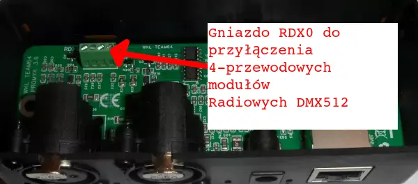

## Wprowadzenie

Moduły bezprzewodowe DMX512 umożliwiają sterowanie oświetleniem scenicznym i efektami specjalnymi bez konieczności użycia kabli.

Moduł radiowy czteroprzewodowy znany ze portalu AliExpress występuje także w innych kolorach PCB np: niebieski. 
Moduł ten może odbierać jak i nadawać ramkę DMX512 poprzez radio. Jeżeli do nadajnika podłączymy sygnał DMX512 to w sparowanym odbiorniku będzie taki sam sygnał jaki dostarczono do nadajnika.

Moduły  operują na częstotliwości 2,4 GHz (wybór kanału radiowego odbywa się automatycznie z zakresu 1 do 126)  a za pomocą przycisku można zmienić grupę kanał radiowego 1 z 7 ( można zrobić maksymalnie 7 grup) a a dioda RGB bardzo ułatwia określenie numeru grupy poprzez odpowiedni kolor.

Dalej stwierdzenie **moduł radiowy** będzie odnosiło do tego konkretnie urządzenia. 

> **UWAGA !!** Te moduły nie są modułami **"WI-FI"**, to jest błędna kwalifikacja, gdyż nie operują na adresach IP i nie są kompatybilne z jakąkolwiek wersją tej technologii. Takie "semantyczne nadużycie" powoduje kompletne zamieszanie i błędy wdrożeniowe. W tym artykule zostały wyjaśnione różnice między tymi standardami: https://wklteam64.blogspot.com/2024/01/przesyanie-bezprzewodowe-protokou.html

## Charakterystyka

- **Standard**: DMX512
- **Zasięg**: do 100 metrów (w warunkach optymalnych)
- **Częstotliwość**: 2.4 GHz, **siedem różnych kanałów radiowych** zmienianych za pomocą przycisku
- **Kanały**: do 512 kanałów DMX
- **Opis żył**: **+5V** (czerwony), **Gnd** (czarny), **dmx512 data+** (biały), **dmx512 data-** (żółty). ***Uwaga***: kolory żył ***data+ /data-*** mogą być zamienione przez różnych producentów
- **TX/RX**
- **pobór prądu**: 120-250mA w zależności od producenta

## Instalacja

Bramka Artnet PROMYK 3.60 posiada dwa wyjścia XLR-3 do podłączenia linii DMX512 oraz jedno RDX0 do podłączenia modułów radiowych. *W środku obudowy można zmieścić jeden moduł radiowy.* 

Złącze **RDX0** jest podłączone do **DX0** i posiada ten sam universe. Wyprowadzone linie zasilania **+5V i masa** na RDX0 stanowią jedyne źródło zasilania dla tego modułu i nie mogą być podłączane do innych miejsc w bramce ARTNET 3.60.

Z zewnątrz można się dostać do złącza **RDX0** bez odkręcania obudowy przez dwa otwory:

- **górny**:  dla płaskiego wkrętaka do dokręcania czterech śrub mocujących przewody 
- **dolny**: do wprowadzania przewodów

  

Przykład modułu przyłączonego do złącza RDX0 w bramce ARTNET PROMYK 3.60 bez obudowy 

> **Do złącza można podłączyć jeden moduł radiowy**, nie można zrównoleglać kolejnych modułów. Urządzenie posiada bezpiecznik termiczny którego nieliniowa charakterystyka zaczyna się po przekroczeniu 0.5A i może zwiększyć rezystancję elementu wyłącząjąc urządzenie. Po ostygnięciu elementu urządzenie wróci do pracy.

> **Poprzednie wersje bramki ARTNET "PROMYK 2.00, 3.00, 3.50** posiadały dwa złącza typu RDX, ale ze względu na zwiększony pobór prądu do nawet 250mA/ moduł radiowy w niektórych przypadkach powodowało wyłączanie bramki Artnet przez zabezpieczenie nadprądowe.

## Materiały techniczne dla starszych wersji bramek Artnet "PROMYK"

- **wersja 1.2**: [http://kwmatik.blogspot.com/2020/12/moduy-radiowe-dmx512-cz1-opis-moduu-i.html](http://kwmatik.blogspot.com/2020/12/moduy-radiowe-dmx512-cz1-opis-moduu-i.html)
- **wersja 2.00**: [https://wklteam64.blogspot.com/2022/09/podaczenie-moduow-radiowych-dmx512-do.html](https://wklteam64.blogspot.com/2022/09/podaczenie-moduow-radiowych-dmx512-do.html)
- **wersja 3.00 i 3.50** [https://wklteam64.blogspot.com/2024/01/przesyanie-bezprzewodowe-protokou.html](https://wklteam64.blogspot.com/2024/01/przesyanie-bezprzewodowe-protokou.html)
  